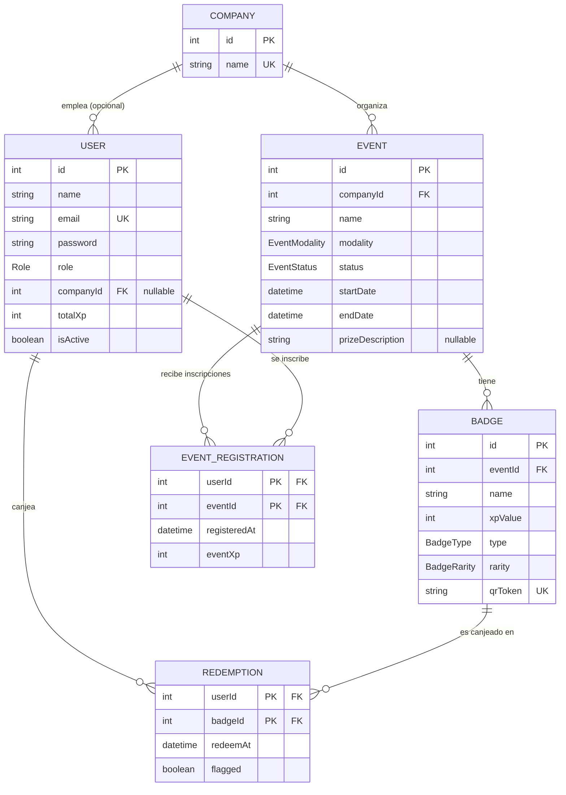

# Lyfter Badge App

Plataforma de gamificación de eventos para Lyfter. Resuelve un problema real: hoy Lyfter no tiene forma de medir asistencia al detalle en sus eventos (presenciales, virtuales o híbridos) — no sabe con certeza quién asistió, qué charlas vio, qué stands visitó, ni quiénes fueron los asistentes más activos. Los participantes escanean QRs en cada charla y stand, acumulan **badges** coleccionables y **XP**, suben de nivel, compiten en un leaderboard y desbloquean un premio al completar el 100% de los badges de un evento — todo respaldado por un panel de administración con métricas y auditoría para el equipo de Lyfter y las empresas aliadas.

## Demo en producción

[https://lyfter-badge-app.vercel.app](https://lyfter-badge-app.vercel.app)

## Cómo funciona

1. **QR de bienvenida** → escanearlo registra al participante en el evento (y lo registra como usuario nuevo sobre la marcha si no tenía cuenta).
2. **QRs de charlas y stands** → cada uno otorga un **badge** + una cantidad de **XP**, con detección de duplicados (no se puede canjear el mismo badge dos veces).
3. El **XP acumulado** sube al participante de **nivel** — los niveles son globales de la plataforma, no por evento.
4. El progreso se refleja en un **leaderboard** (general y por evento).
5. Los badges se pueden **compartir en redes sociales** (imagen generada dinámicamente por badge).
6. Al completar el **100% de los badges disponibles** de un evento, se revela un **premio**.
7. Detrás de todo esto hay un **panel de administración** (Super Admin / Admin de Empresa) con CRUD de eventos y badges, métricas, y un registro de auditoría.

## Roles

| Rol                                    | Alcance                  | Puede hacer                                                                                                             |
| -------------------------------------- | ------------------------ | ----------------------------------------------------------------------------------------------------------------------- |
| **Super Admin**                        | Toda la plataforma       | Administra empresas, eventos, usuarios y badges de forma global.                                                        |
| **Admin de Empresa** (`COMPANY_ADMIN`) | Solo sus propios eventos | CRUD de eventos/badges de su empresa, métricas y auditoría scoped. **Sin visibilidad sobre eventos de otras empresas.** |
| **Participante**                       | Su propia experiencia    | Escanea QRs, acumula badges y XP, revisa su perfil y el leaderboard.                                                    |

**Regla crítica de seguridad:** el aislamiento entre empresas no es solo de UI — cada acción sensible del Admin de Empresa valida en el backend (`lib/auth-guard.ts` + `proxy.ts`) que el recurso le pertenece a su propia empresa, nunca confiando el filtrado solo a esconder botones en el frontend.

## Stack técnico

| Capa                      | Elección                                            | Por qué                                                                                |
| ------------------------- | --------------------------------------------------- | -------------------------------------------------------------------------------------- |
| Framework                 | **Next.js 16** (App Router, Turbopack) + TypeScript | Full-stack sin backend separado — requisito de la actividad.                           |
| Backend                   | Route Handlers / Server Actions de Next.js          | La forma nativa de hacer full-stack en Next.js.                                        |
| Base de datos             | **PostgreSQL** vía **Neon**                         | Serverless, escala a cero, _branching_ de DB por preview deployment.                   |
| ORM                       | **Prisma**                                          | Migraciones versionadas + type-safety de punta a punta.                                |
| Auth                      | **JWT manual** (`jose`)                             | Sesión stateless, sin lectura extra a la DB en cada request — ver justificación abajo. |
| Storage de imágenes       | **Vercel Blob**                                     | Integración simple con el stack de deploy.                                             |
| UI                        | **Tailwind CSS v4 + shadcn/ui** (sobre Base UI)     | Componentes copiados al repo, 100% themeable, tema oscuro fijo con la paleta de marca. |
| Validación                | **Zod**                                             | Esquema compartido entre formularios de cliente y Server Actions.                      |
| Formularios               | **React Hook Form**                                 | Estándar en los paneles de admin.                                                      |
| QR                        | `qrcode` + `jose` (token rotativo firmado)          | Antifraude — ver más abajo.                                                            |
| Escaneo de QR             | `@zxing/browser`                                    | Lectura de cámara en el navegador.                                                     |
| Imagen dinámica de badges | `next/og` (Satori)                                  | `og:image` para compartir en redes.                                                    |
| Testing                   | **Vitest**                                          | 209 tests, mockeado, sin tocar la DB real.                                             |
| Deploy                    | **Vercel**                                          | Requisito de la actividad.                                                             |

## Decisiones de arquitectura

**Separación de capas.** Cada módulo de negocio (`src/modules/<dominio>/`) sigue el mismo patrón: `*.repository.ts` (única capa que toca Prisma) → `*.service.ts` (reglas de negocio, framework-agnostic, testeable sin levantar Next.js) → `*.actions.ts` (Server Actions / Route Handlers: solo guard de auth + llamada al service). `src/app/` es exclusivamente enrutamiento y composición — cero lógica de negocio ahí.

**Auth manual con JWT, sin tabla `Session`.** Se evaluó una tabla `Session` propia (token opaco + hash en DB) y se descartó a favor de un JWT firmado y stateless: no requiere una lectura a la DB en cada request (más liviano en serverless con Neon), transportado en cookie `httpOnly` + `secure` + `sameSite=lax`, expiración fija de 7 días sin re-emisión silenciosa. El único costo real de un JWT (no poder revocarlo antes de que expire) no aplicaba acá porque ya se había decidido que alcanza con dejar expirar la sesión. Se evaluó también Better Auth como punto de partida y se revirtió: su modelo de datos (`Account`/`Verification` con IDs string, password fuera de `User`) no encajaba con los IDs `Int` autoincrementales del resto del schema, agregando una capa de indirección sin valor claro para el alcance del proyecto.

**Antifraude de QR, en capas.** El riesgo real no es el doble-canje (ya resuelto por un constraint único `userId+badgeId`) sino que alguien comparta una foto del QR para que otra persona reclame el badge sin estar presente. La mitigación es en capas, priorizando no agregar fricción a quien sí asiste:

1. **QR rotativo con token firmado de vida corta** (mecanismo principal): el QR que se muestra en cada charla/stand no es estático — codifica un JWT de 60s de vida, regenerado automáticamente en pantalla. El backend valida firma + expiración antes de aplicar la unicidad usuario+badge. Una captura de pantalla vieja deja de servir en menos de un minuto.
2. **Geolocalización blanda** (solo eventos presenciales, complementaria y no bloqueante): si el navegador da permiso, se compara la ubicación contra las coordenadas del evento con tolerancia de 150m. Fuera de rango → el canje se marca `flagged` para revisión del admin, nunca se bloquea automáticamente (para no penalizar falsos positivos por mala señal GPS).
3. **Detección de anomalías**: patrones sospechosos (mismo badge canjeado por muchas cuentas distintas en poco tiempo desde el mismo origen) quedan señalados para el dashboard de auditoría.

**Idempotencia del canje.** El backend debe tolerar reintentos sin duplicar XP (señal inestable en eventos presenciales es un caso real y esperado). La escritura atómica de un canje (crear `Redemption` + otorgar XP + `EventRegistration`) vive en un solo método del repository con `prisma.$transaction`. La idempotencia se implementa **intentando crear primero y atrapando la violación del constraint único** (código `P2002` de Prisma), nunca con un patrón "buscar y luego crear" — que tiene una condición de carrera real bajo reintentos concurrentes.

**Niveles globales de plataforma, no por evento.** El XP es configurable por badge (por el admin del evento), pero los umbrales de nivel son fijos y globales, calculados sobre el XP acumulado total del usuario — no existe un "nivel por evento" separado. No hay tabla `Level`: los umbrales son constantes en código (`xp-levels.service.ts`), porque no son editables desde ningún panel.

## Modelo de datos



`EventRegistration` es el join usuario↔evento (inscripción, vía el badge de bienvenida) y `Redemption` es el join usuario↔badge (canje), con una constraint única `[userId, badgeId]` que impide el doble canje. El schema completo, con todos los campos, índices y dos tablas auxiliares (`AuditLog` para el registro de auditoría, `DashboardSnapshot` para las tendencias del dashboard) vive en [`prisma/schema.prisma`](prisma/schema.prisma).

## Instalación y desarrollo local

**Requisitos:** Node.js 20+, una base de datos PostgreSQL (el proyecto está pensado para [Neon](https://neon.tech), que da tanto la URL pooled como la directa que se necesitan).

```bash
git clone <url-del-repo>
cd lyfter-badge-app
npm install
```

Copiar `.env.example` a `.env` y completar las variables (`DATABASE_URL`/`DIRECT_URL` de tu base de Neon, dos secretos cualquiera para `SESSION_SECRET`/`QR_TOKEN_SECRET` — deben ser distintos entre sí, para que comprometer uno no comprometa el otro — y `NEXT_PUBLIC_APP_URL`, que en desarrollo alcanza con dejarlo en `http://localhost:3000`):

```bash
cp .env.example .env
```

Aplicar el schema y cargar datos de prueba:

```bash
npx prisma migrate dev
npx prisma db seed
```

Levantar el servidor de desarrollo:

```bash
npm run dev
```

Abrir [http://localhost:3000](http://localhost:3000).

### Usuarios de prueba (del seed)

| Rol                   | Email                                                          | Contraseña         |
| --------------------- | -------------------------------------------------------------- | ------------------ |
| Super Admin           | `admin@example.com`                                            | `superadmin123`    |
| Admin — Acme Corp     | `companyadmin@example.com`                                     | `companyadmin123`  |
| Admin — Neko          | `nekoadmin@example.com`                                        | `nekoadmin123`     |
| Admin — Umbrella Labs | `umbrellaadmin@example.com`                                    | `umbrellaadmin123` |
| Participante          | `part@example.com` / `part2@example.com` / `part3@example.com` | `participant123`   |

El seed no solo crea las cuentas: también deja datos de participación reales en el evento insignia de Acme (**Lyfter DevCon 2026**) para poder probar el panel de admin sin tener que canjear QRs a mano:

- `part@example.com` completa el **100%** de los badges (revela el premio), con uno de sus canjes marcado `flagged` a propósito, para ver el stat card de "canjes flagged" con datos reales. También está inscrito en el evento de Neko, para confirmar que un mismo participante puede estar en eventos de más de una empresa.
- `part2@example.com` queda en **75%** (progreso parcial).
- `part3@example.com` solo tiene el badge de bienvenida (**25%**).

Además, el seed carga 22 eventos en Acme Corp, 6 en Neko y 6 en Umbrella Labs (mezclando modalidades y estados) para poder probar paginación y el aislamiento multi-tenant entre `COMPANY_ADMIN` de distintas empresas.

Sobre el ambiente de producción, también se cargaron a mano cerca de 15 participantes adicionales (fuera del seed), con distintos niveles de progreso y canjes, para tener volumen real al probar el dashboard, el leaderboard y los listados del panel de admin.

## Testing

```bash
npm test
```

209 tests con Vitest, uno por módulo de negocio. Cada test mockea el _repository_ del módulo (`vi.mock` sobre `*.repository.ts`) para que el service corra su lógica real (validaciones, errores tipados, orquestación) sin tocar la base de datos real — el objetivo es probar reglas de negocio rápido y en aislamiento, no reemplazar pruebas de integración contra la DB real (que se hicieron manualmente durante el desarrollo de cada módulo).

## Estructura de carpetas

```
src/
├── app/            # Rutas (App Router) — solo enrutamiento y composición, sin lógica de negocio
│   ├── (public)/   # Landing, login, registro, vistas públicas
│   ├── (participant)/ # Home, badges, leaderboard, perfil, escaneo de QR (mobile-first)
│   ├── admin/      # Panel Super Admin / Admin de Empresa (dashboard, eventos, badges, usuarios, auditoría)
│   ├── badge/[badgeId]/ # Página pública de un badge (sin auth), para compartir en redes
│   └── api/        # Route Handlers (auth, QR generate/redeem, imagen og de badges)
├── modules/        # Lógica de negocio por dominio (repository → service → actions)
├── components/     # ui/ (primitivos shadcn), shared/, participant/, admin/
├── lib/            # Utilidades transversales (sesión, auth-guard, token de QR, geolocalización, prisma client)
└── proxy.ts        # Protección de rutas por rol, antes de renderizar
prisma/             # schema.prisma, migraciones, seed.ts
tests/unit/         # Suite de Vitest, un archivo por módulo
```

## Deploy

Pensado para desplegarse en **Vercel**. Variables de entorno necesarias en producción (las mismas de `.env.example`, con valores de producción): `DATABASE_URL`, `DIRECT_URL`, `SESSION_SECRET`, `QR_TOKEN_SECRET`, y `NEXT_PUBLIC_APP_URL` apuntando al dominio real desplegado (`https://lyfter-badge-app.vercel.app`) — si queda en `localhost`, los crawlers de redes sociales (Twitter/LinkedIn/WhatsApp) no pueden resolver la imagen `og:image` al compartir un badge. Como la app corre 100% serverless (sin cron ni procesos en background), no necesita ninguna configuración de infraestructura además de las variables de entorno y la conexión a la base de datos de Neon.
